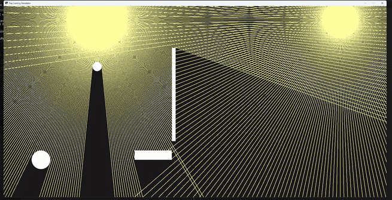

A 2D ray casting simulation built using python and pyglet.

Casts dynamic rays from two light sources.
Rays gets blocked by objects (circles and rectangles) and casts shadows.
Objects can be moved with your mouse and rays will update accordingly.

How to run:

Clone repo:
git clone https://github.com/Emilwikk/Ray-Casting.git 
cd ray casting

Download pyglet:
pip install pyglet>=2.0

Run:
py main.py

